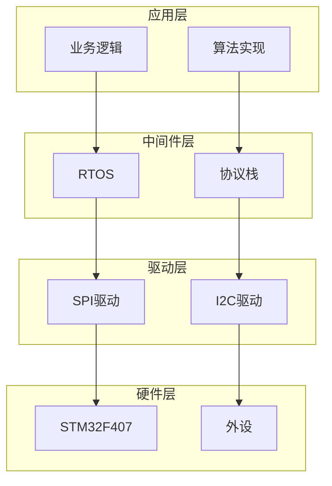

# 嵌入式开发快速参考指南

## 常用命令

### 需求分析
```markdown
# 分析项目需求
用户: "帮我分析这个智能温控器项目的需求"

# 输出: 00_ProjectManagement/ 下的各个需求文件夹
```

### 系统架构设计
```markdown
# 设计系统架构
用户: "帮我设计这个系统的架构"

# 输出: 00_Reference/documentation/system/architecture/
```

### 硬件设计
```markdown
# 设计硬件
用户: "帮我设计这个产品的硬件"

# 输出: 02_Hardware/ 下的各个文件夹
```

### 机械设计
```markdown
# 设计3D外壳
用户: "帮我设计这个产品的3D外壳"

# 输出: 03_Mechanical/ 下的各个文件夹
```

### 固件开发
```markdown
# 实现固件
用户: "帮我实现这个产品的固件"

# 输出: 04_Firmware/ 下的各个文件夹
```

### 应用软件开发
```markdown
# 实现应用软件
用户: "帮我实现这个产品的应用软件"

# 输出: 05_Software/ 下的各个文件夹
```

### 上位机开发
```markdown
# 实现控制端
用户: "帮我实现这个产品的控制端"

# 输出: 07_Tools/ 下的各个文件夹
```

### 测试
```markdown
# 测试产品
用户: "帮我测试这个产品"

# 输出: 05_Software/tests/ 下的测试文件
```

### 生产准备
```markdown
# 准备生产
用户: "帮我准备生产"

# 输出: 06_Factory/ 下的各个文件夹
```

## 常用技能

### 架构设计
- `embedded-architect`: 系统架构设计
- `chip-architecture`: 芯片架构理解
- `api-design`: 接口设计
- `architecture-decision-records`: 架构决策记录

### 硬件设计
- `hardware-design`: 硬件设计工作流
- `i2c-bus`: I2C 总线设计
- `spi-bus`: SPI 总线设计
- `uart-module`: UART 模块设计

### 固件开发
- `firmware-development`: 固件开发工作流
- `peripheral-driver`: 外设驱动开发
- `freertos-module`: FreeRTOS 配置
- `stm32-hal-development`: STM32 HAL 开发

### 应用软件
- `backend-patterns`: 后端模式
- `coding-standards`: 编码标准
- `error-handling`: 错误处理
- `static-analysis`: 静态分析

### 上位机开发
- `frontend-patterns`: 前端模式
- `react-patterns`: React 开发
- `vue-patterns`: Vue 开发
- `dart-flutter-patterns`: Flutter 开发

### 测试验证
- `tdd-workflow`: 测试驱动开发
- `testing-cicd`: 测试 CI/CD 工作流
- `embedded-debugger-framework`: 故障诊断
- `security-review`: 安全审查

### 版本控制
- `git-workflow`: Git 工作流
- `firmware-sign`: 固件签名
- `ci-workflow`: CI/CD 工作流

## 常用工作流

### 需求工程
```bash
# 调用需求工程工作流
用户: "帮我分析这个项目的需求"
```

### 固件开发
```bash
# 调用固件开发工作流
用户: "帮我开发这个产品的固件"
```

### 硬件设计
```bash
# 调用硬件设计工作流
用户: "帮我设计这个产品的硬件"
```

### 测试 CI/CD
```bash
# 调用测试 CI/CD 工作流
用户: "帮我测试这个产品"
```

### 生产管理
```bash
# 调用生产管理工作流
用户: "帮我准备生产"
```

## 文档模板

### 需求文档模板
```markdown
# 项目需求文档

## 项目背景
[描述项目背景]

## 功能需求
| 序号 | 需求描述 | 优先级 |
|------|----------|--------|
| 1 | [需求1] | 高 |
| 2 | [需求2] | 中 |

## 非功能需求
- 性能要求: [描述]
- 安全要求: [描述]
- 可靠性要求: [描述]

## 约束条件
- 硬件约束: [描述]
- 软件约束: [描述]
- 时间约束: [描述]
```

### 架构文档模板
```markdown
# 系统架构设计文档

## 系统概述
[描述系统概述]

## 分层架构


## 接口定义
[描述接口定义]
```

### 测试报告模板
```markdown
# 测试报告

## 测试概述
- 测试时间: [时间]
- 测试环境: [环境]
- 测试人员: [人员]

## 测试结果
| 测试项 | 预期结果 | 实际结果 | 状态 |
|--------|----------|----------|------|
| [测试项1] | [预期] | [实际] | 通过 |
| [测试项2] | [预期] | [实际] | 失败 |

## 问题汇总
| 问题ID | 描述 | 严重程度 | 状态 |
|--------|------|----------|------|
| 001 | [描述] | 高 | 已修复 |

## 结论
[总结测试结果]
```

## 故障排除

### 常见问题

#### 1. UART 通信问题
```markdown
# 诊断步骤
1. 检查硬件连接
2. 检查波特率配置
3. 检查引脚配置
4. 使用示波器检查波形

# 技能调用
用户: "UART 通信有问题，帮我诊断"
```

#### 2. SPI 通信问题
```markdown
# 诊断步骤
1. 检查 SPI 模式
2. 检查时钟极性
3. 检查片选信号
4. 检查数据格式

# 技能调用
用户: "SPI 通信有问题，帮我诊断"
```

#### 3. I2C 通信问题
```markdown
# 诊断步骤
1. 检查上拉电阻
2. 检查设备地址
3. 检查时钟速度
4. 检查 ACK 信号

# 技能调用
用户: "I2C 通信有问题，帮我诊断"
```

#### 4. RTOS 任务问题
```markdown
# 诊断步骤
1. 检查任务优先级
2. 检查任务栈大小
3. 检查任务同步
4. 检查中断处理

# 技能调用
用户: "RTOS 任务有问题，帮我诊断"
```

## 性能优化

### 代码优化
- 使用编译器优化选项
- 减少函数调用开销
- 优化数据结构
- 使用 DMA 传输

### 内存优化
- 减少全局变量
- 使用局部变量
- 优化缓冲区大小
- 使用内存池

### 功耗优化
- 使用低功耗模式
- 优化时钟配置
- 关闭未使用外设
- 使用睡眠模式

## 版本管理

### Git 工作流
```bash
# 创建特性分支
git checkout -b feature/your-feature

# 提交更改
git add .
git commit -m "feat: 添加新功能"

# 推送到远程
git push origin feature/your-feature

# 创建 Pull Request
# 在 GitHub 上创建 PR
```

### 提交信息规范
```
<type>: <subject>

<body>

<footer>
```

类型:
- `feat`: 新功能
- `fix`: 修复 bug
- `docs`: 文档更新
- `style`: 代码格式
- `refactor`: 重构
- `test`: 增加测试
- `chore`: 构建过程变动

## 参考资源

### 官方文档
- [STM32F407 Reference Manual](https://www.st.com/resource/en/reference_manual/stm32f405415-stm32f407417-stm32f427437-and-stm32f429439-advanced-armbased-32bit-mcus-stmicroelectronics.pdf)
- [FreeRTOS Reference Manual](https://www.freertos.org/Documentation/02-Kernel/02-Kernel-Porting/01-Porting-a-FreeRTOS-kernel)
- [ESP-IDF Programming Guide](https://docs.espressif.com/projects/esp-idf/en/latest/esp32/)

### 学习资源
- [嵌入式系统架构师思维框架](~/.claude/skills/embedded-architect/SKILL.md)
- [嵌入式系统故障诊断框架](~/.claude/skills/embedded-debugger-framework/SKILL.md)
- [固件开发管理工作流](~/.claude/workflows/firmware-development/)
