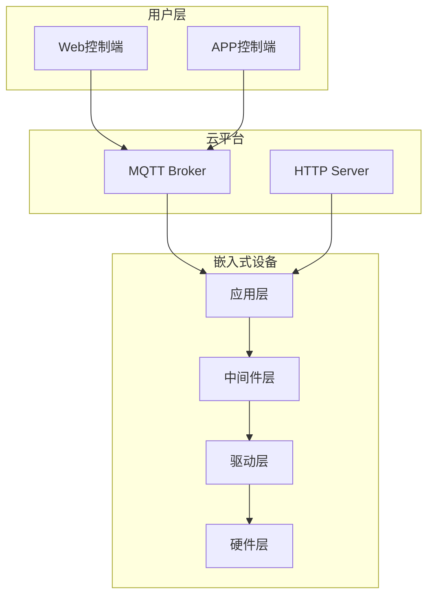
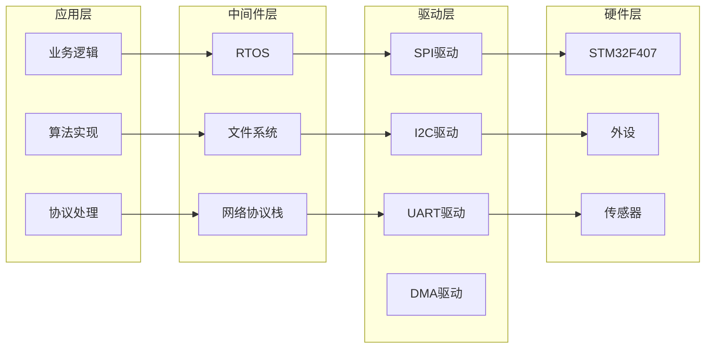
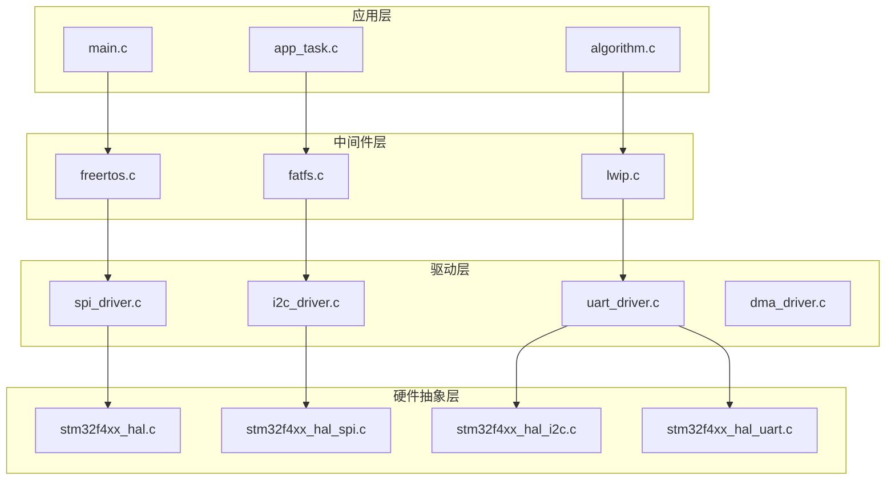

# 系统架构设计文档

## 1. 文档信息

| 项目 | 内容 |
|------|------|
| 文档名称 | 系统架构设计文档 |
| 版本号 | 1.0.0 |
| 创建日期 | 2026-06-24 |
| 作者 | [作者姓名] |
| 审核人 | [审核人姓名] |

## 2. 修订历史

| 版本 | 日期 | 作者 | 修改内容 |
|------|------|------|----------|
| 1.0.0 | 2026-06-24 | [作者姓名] | 初始版本 |

## 3. 项目概述

### 3.1 项目背景

[描述项目背景和目标]

### 3.2 系统功能

[描述系统主要功能]

### 3.3 系统约束

[描述系统约束条件]

## 4. 系统架构

### 4.1 整体架构



### 4.2 分层架构



## 5. 硬件架构

### 5.1 MCU选型

| 参数 | 规格 |
|------|------|
| 型号 | STM32F407VGT6 |
| 内核 | ARM Cortex-M4 |
| 主频 | 168MHz |
| Flash | 1MB |
| RAM | 192KB |
| 封装 | LQFP100 |

### 5.2 外设分配

| 外设 | 功能 | 引脚 |
|------|------|------|
| SPI1 | 传感器通信 | PA5(SCK), PA6(MISO), PA7(MOSI) |
| I2C1 | EEPROM通信 | PB6(SCL), PB7(SDA) |
| UART1 | 调试串口 | PA9(TX), PA10(RX) |
| UART2 | 通信串口 | PA2(TX), PA3(RX) |
| TIM2 | 定时器 | - |
| ADC1 | 模拟采集 | PA0-PA3 |

### 5.3 电源设计

| 电源 | 电压 | 电流 | 用途 |
|------|------|------|------|
| VDD | 3.3V | 100mA | 数字电路 |
| VDDA | 3.3V | 10mA | 模拟电路 |
| VBAT | 3.0V | 1mA | RTC备份 |

## 6. 软件架构

### 6.1 固件架构



### 6.2 任务设计

| 任务 | 优先级 | 堆栈大小 | 周期 | 功能 |
|------|--------|----------|------|------|
| SensorTask | 5 | 256 words | 100ms | 传感器数据采集 |
| ControlTask | 4 | 512 words | 50ms | 控制算法执行 |
| CommTask | 3 | 1024 words | 200ms | 通信数据处理 |
| DisplayTask | 2 | 256 words | 500ms | 显示更新 |
| IdleTask | 0 | 128 words | - | 空闲任务 |

## 7. 通信架构

### 7.1 通信协议

| 协议 | 用途 | 端口 |
|------|------|------|
| MQTT | 设备与云平台通信 | 1883 |
| HTTP | Web控制端通信 | 80 |
| WebSocket | 实时数据推送 | 8080 |
| UART | 设备间通信 | - |

### 7.2 数据格式

```json
{
  "deviceId": "设备ID",
  "timestamp": "时间戳",
  "type": "消息类型",
  "data": {
    "temperature": 25.5,
    "humidity": 60.2,
    "status": "正常"
  }
}
```

## 8. 安全设计

### 8.1 数据安全

- 数据传输加密（TLS/SSL）
- 数据存储加密
- 访问权限控制

### 8.2 设备安全

- 固件签名验证
- 安全启动
- 防篡改检测

## 9. 性能设计

### 9.1 性能指标

| 指标 | 目标值 |
|------|--------|
| 系统启动时间 | < 2秒 |
| 传感器采样率 | 10Hz |
| 控制响应时间 | < 50ms |
| 通信延迟 | < 100ms |

### 9.2 资源使用

| 资源 | 使用量 | 剩余量 |
|------|--------|--------|
| Flash | 256KB | 768KB (75%) |
| RAM | 64KB | 128KB (67%) |
| CPU负载 | 30% | 70% |

## 10. 部署设计

### 10.1 部署环境

| 环境 | 说明 |
|------|------|
| 开发环境 | 本地开发和调试 |
| 测试环境 | 系统测试和验证 |
| 生产环境 | 实际部署运行 |

### 10.2 部署流程

1. 代码审查
2. 单元测试
3. 集成测试
4. 系统测试
5. 预发布测试
6. 正式发布

## 11. 附录

### 11.1 术语表

| 术语 | 说明 |
|------|------|
| MCU | 微控制器单元 |
| RTOS | 实时操作系统 |
| HAL | 硬件抽象层 |
| DMA | 直接内存访问 |

### 11.2 参考文档

- STM32F407 Reference Manual
- FreeRTOS Reference Manual
- MQTT Protocol Specification

---

**文档结束**
